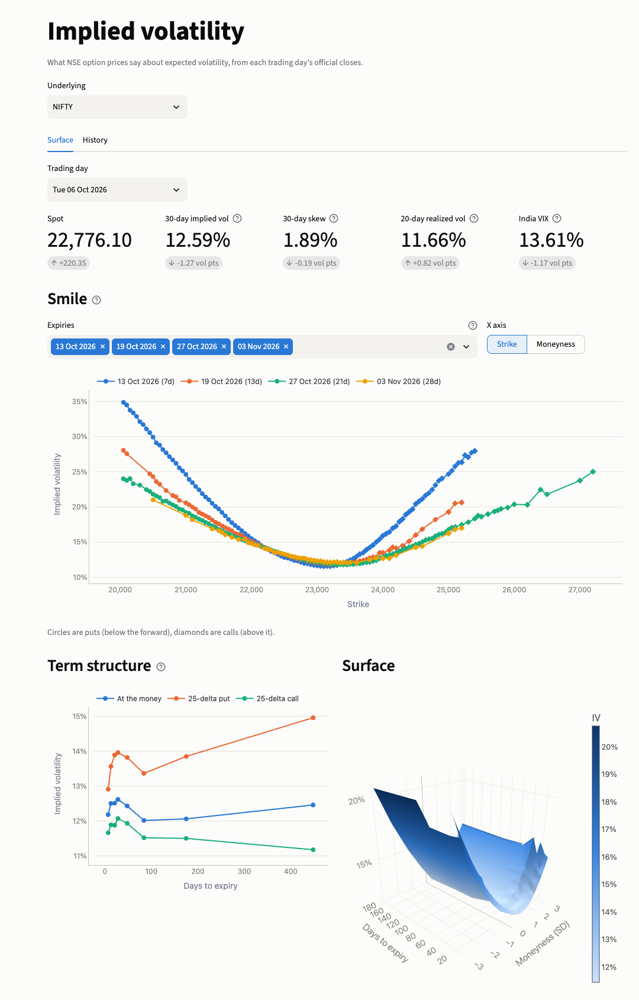
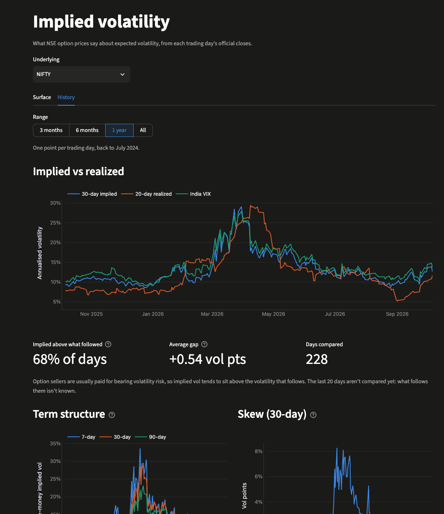
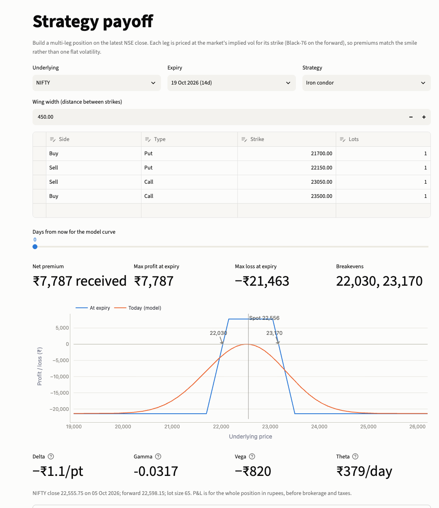

# Options Pricing & Volatility Lab

Option pricing models built and tested from scratch, applied to real NSE data: a daily implied
volatility surface for NIFTY, BANKNIFTY and RELIANCE, rebuilt from NSE's official end-of-day files
with a history back to July 2024.

**Live demo:** https://options-pricing-lab.onrender.com. It runs on Render's free plan, which sleeps
after 15 minutes idle, so the first visit can take about a minute to wake up. The data updates every
weekday evening.



## What's in it

| Page | What it shows |
|---|---|
| **Volatility surface** | For any trading day: the smile per expiry, ATM and 25-delta term structure, and a 3D surface. Spot, 30-day ATM vol, 25Δ skew, realized vol and India VIX with day-on-day changes. |
| **Volatility history** | 30-day implied vs 20-day realized vol vs India VIX, the term structure and skew over time, and how often implied vol overpriced the volatility that followed. |
| **Model vs market** | Heston (one set of five parameters per day for the whole surface) and SABR (one smile per expiry) fitted to every trading day: the fitted parameters, each model against the market's smile, a heatmap of where Heston misses, SABR's parameters by expiry, and how Heston's parameters moved over two years. |
| **Strategy payoff** | Multi-leg positions (spreads, straddles, condors, butterflies, or your own legs) on the latest close. Each leg is priced at its strike's implied vol, with P&L in ₹ per lot, breakevens, max profit/loss and position Greeks. |
| **Pricer** | One option priced by Black-Scholes, a binomial tree and Monte Carlo side by side, with Greeks, the early-exercise premium for American options, and an implied-vol calculator. Loads the latest NIFTY at-the-money option in one click. |
| **Greeks** | Delta, gamma, vega, theta and rho against spot, volatility or time to expiry. |
| **Model convergence** | The tree's error against steps (≈1/n) and Monte Carlo's confidence interval against paths (≈1/√n), measured against the exact Black-Scholes price. |
| **Heston model** | Sliders for Heston's five parameters (preloaded with the latest NIFTY fit) and the smile and at-the-money term structure they produce, the sidebar option's Heston price, and a Monte Carlo check against the formula. |

## Findings from the data

From 562 trading days, 1 Jul 2024 to 5 Oct 2026, all computed from the published dataset:

- **The pipeline tracks India VIX.** NIFTY's 30-day ATM vol has a 0.975 correlation with India VIX.
  VIX sits above it on 95% of days, by about 1 point. That's expected: VIX averages over the whole
  strip of strikes, including the expensive put wing.
- **Implied vol usually overprices what follows.** 30-day ATM vol exceeded the next 20 days'
  realized vol on 67% of days for NIFTY (median gap +1.4 points), 67% for BANKNIFTY (+1.6) and 56%
  for RELIANCE (+0.65): the variance risk premium that option sellers collect.
- **Index puts carry more crash premium than single-stock puts.** NIFTY's 25-delta skew averaged
  2.2 vol points against 1.2 for RELIANCE.
- **Stress inverts the term structure.** On the 10% of days with the highest NIFTY 30-day vol, 90-day
  vol was below 30-day vol every time; across all days it sloped upward only half the time. 30-day vol
  ranged from 8.6% (24 Dec 2025) to 29.1% (30 Mar 2026).
- **Corporate actions need handling.** RELIANCE's 1:1 bonus on 28 Oct 2024 halved the price and
  doubled the lot size. Taken at face value, 20-day realized vol reads 245%; the pipeline spots a
  price jump matched by a lot-size change and counts only the change in contract value.

### What the Heston and SABR fits show

Heston fitted to expiries from a week to a year, SABR to each expiry, both between the 5-delta put and
call, on every trading day since July 2024:

- **SABR fits a single smile almost exactly; Heston fits the whole surface well.** Median error is
  0.11 vol points for SABR (0.22 for RELIANCE) against 0.25–0.39 for Heston, which has to explain
  every expiry with one set of five numbers.
- **Heston's spot vol is the market's short-dated vol.** √v₀ has a 0.98 correlation with NIFTY's
  7-day ATM vol and 0.95 with India VIX.
- **Stress steepens the skew.** NIFTY's spot-vol correlation ρ has a median of −0.38, falling to
  −0.55 on the 10% of days with the highest 30-day vol; Heston's fit error also rises (0.33 → 0.57
  points). RELIANCE's ρ is only −0.12: single-stock smiles are flatter.
- **The Feller condition fails almost every day** (96–100% of days): matching an index skew needs a
  vol of vol large enough for the variance to touch zero.
- **Monthly-only underlyings can't pin down mean reversion.** κ sits at its cap of 30 (an 8-day
  half-life) on 57% of RELIANCE days and 18% of BANKNIFTY days, against 3% for NIFTY with its weekly
  expiries. Letting it go higher lowers the error a little at the price of parameters like a
  one-day half-life.
- **Expiries under a week need jumps.** Averaged over all NIFTY days, Heston's vols for expiries under
  a week (left out of the fit) are 1.2–1.3 points too low in the wings and 0.3 too high at the money:
  those smiles are steeper than any diffusion produces. Inside the fitted range the average miss in
  any region is under 0.45 points.
- **The far wings are lottery tickets.** Beyond the 5-delta wings, options trade at a few rupees at
  vols no diffusion reaches (a one-week NIFTY put 11 standard deviations out closed at ₹0.85, an
  implied vol of 52%). In a first run that fitted them too, they caused every one of the worst NIFTY
  fits and pushed κ to its cap on 74% of BANKNIFTY and 87% of RELIANCE days. Both fits now leave them out.

| Volatility history (dark theme) | Strategy payoff |
|---|---|
|  |  |

## How it works

```
NSE bhavcopy (daily zip) ──► optlab/market/nse.py      parse options + futures
                         ──► optlab/market/forwards.py forward per expiry from put-call parity
                         ──► optlab/market/chain.py    clean OTM quotes, invert Black-76 → IV
                         ──► optlab/surface.py         ATM / 25Δ / fixed-tenor summary
                         ──► market-data branch        parquet, one file per underlying-month
                         ──► optlab/calibration.py     Heston per day, SABR per expiry → models/
                                     │
               GitHub Actions, weekdays 20:17 IST      ▼
                                              Streamlit app (Render)
```

- **`optlab/`** is a plain Python library with no Streamlit in it: the pricing models
  (`models/`), implied vol, finite-difference Greeks, the NSE pipeline (`market/`) and strategy maths.
- **`scripts/ingest.py`** adds trading days to the dataset. It's idempotent, skips holidays, and
  looks back 10 days so a missed day gets filled in by the next run. It tries every calendar date,
  because NSE occasionally trades on a weekend (Budget day 2025 was a Saturday). One failing day
  doesn't stop the others; the run reports it and exits non-zero.
- **`scripts/calibrate.py`** fits Heston and SABR to every day that doesn't have a fit yet (the
  whole history takes under two minutes on 8 cores; a new day takes a second), warm-starting each
  Heston fit from the previous day's.
- **`scripts/rebuild_summary.py`** recomputes the daily summary from the stored quotes after a
  change to how it's derived, without downloading anything.
- **`.github/workflows/ingest.yml`** runs ingest and calibration every weekday evening and commits to the
  `market-data` branch. The app reads that branch, so it never calls NSE itself.
- The maths, and what each piece is checked against, is in [docs/models.md](docs/models.md).

## Testing

140 tests run in CI (`ruff` + `pytest`, about 15 seconds, no network):

- **Models:** Hull's textbook values for prices, Greeks and the 5-step American put; put-call
  parity; tree → Black-Scholes convergence, including the low-vol cases where the tree switches
  lattice; tree delta and gamma against Black-Scholes and a fine tree; Monte Carlo within 3
  standard errors; analytic vs finite-difference Greeks; American implied vol round trips.
- **Heston and SABR:** the published Fang–Oosterlee reference price (5.785155450) to 1e-7; the fast
  integration against adaptive quadrature from 2 days to 2 years; put-call parity; the Black-Scholes
  limit; Monte Carlo against the formula; SABR's flat, symmetric and ATM limits. Calibration recovers
  known Heston and SABR parameters from synthetic markets, ignores corrupted far-wing quotes, and fits
  a real NIFTY day to under 1.5 points.
- **Implied vol:** round trips over a grid of strikes, maturities and vols; NaN outside
  no-arbitrage bounds.
- **Pipeline:** parsing a real (trimmed) bhavcopy; NSE's HTTP handling (404 skip, 403 fail-fast,
  429/5xx retry, HTML-instead-of-zip); parity forwards within 10 bp of the futures; recovering a
  known smile from synthetic prices; the ATM gap gate and order-independent 25-delta vols;
  idempotent storage; realized vol across a bonus issue and a lot-size revision; ingest with
  weekend sessions, a failing day mid-run, a newly added underlying, VIX retries and month flushes.
- **Strategies:** breakevens, bounded vs unlimited P&L (including a short put's spot-to-zero case),
  that an iron condor collects a credit, and theta (with the forward rolling down) against the
  value a moment later.
- **App:** every page renders (Streamlit AppTest), plus regressions for state and edge cases:
  sidebar inputs surviving a trip to a market page, per-underlying strategy widths, low-vol and
  American inputs, a missing latest chain, an underlying with no data, and working offline. The
  tests point the data URL at a closed port, so they can't quietly fetch from GitHub.

## Quick start

```bash
python3.12 -m venv venv
./venv/bin/pip install -r requirements-dev.txt
./venv/bin/python -m pytest -q
./venv/bin/streamlit run app.py   # reads the published dataset from GitHub
```

To work with a local copy of the dataset, check out the data branch into `data/` (the app prefers
it when present), or rebuild it from NSE:

```bash
git worktree add data market-data
# or, from scratch (~570 trading days, about an hour; keeps the raw zips in .cache/):
./venv/bin/python -m scripts.ingest --data-dir data --since 2024-07-01 --cache-dir .cache/bhavcopy
```

## Data caveats

- **End-of-day only.** The bhavcopy has closing prices, not bid/ask, so the surface updates daily.
  Closes are NSE's volume-weighted average of the last half hour, which keeps options and the
  underlying roughly in step.
- **Liquidity filter.** Quotes need 20+ trades and a price of at least ₹0.50, so far wings and
  long-dated expiries are thin. NIFTY lists options out to 2031 but only the first year or so trades.
- **Rate.** A single 5.5% rate (the 91-day T-bill in September 2026) is used throughout. Forwards come
  from put-call parity, so the rate only affects discounting, which moves a 30-day vol by well
  under 1% of its value even across 2024's higher rates.
- **Source.** NSE's public archive, for research and education. Not investment advice.

## Roadmap

- **Exotic options** (Asian, barrier, lookback) on the Monte Carlo engine, with variance reduction
  (antithetic, control variates, Sobol) and numba speed-ups, priced under Black-Scholes and Heston.
